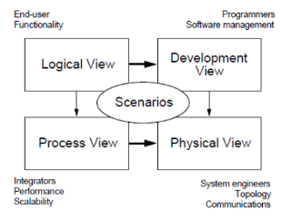
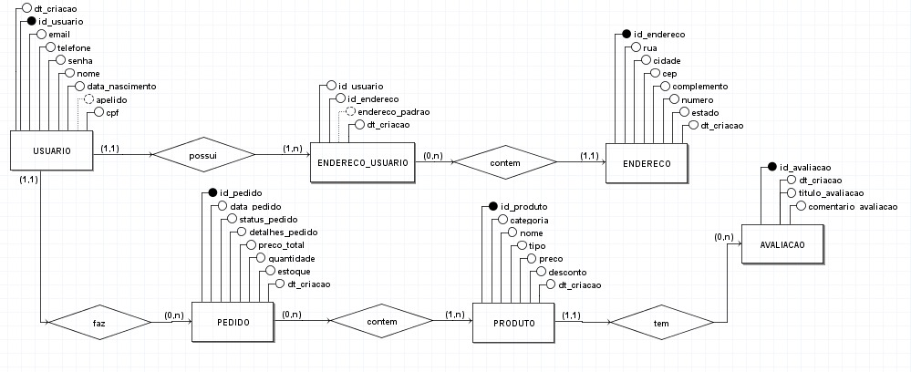
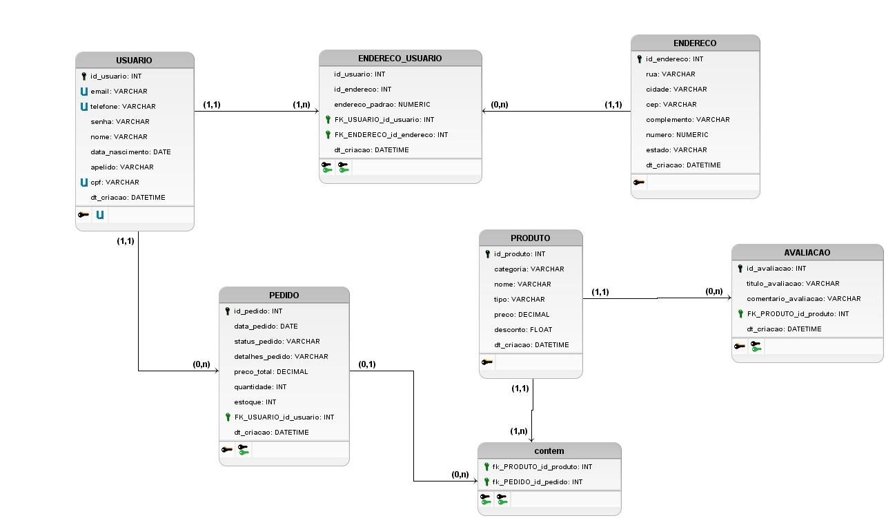
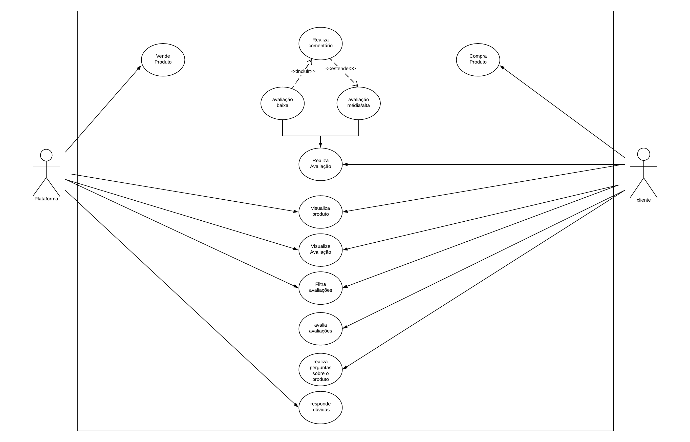
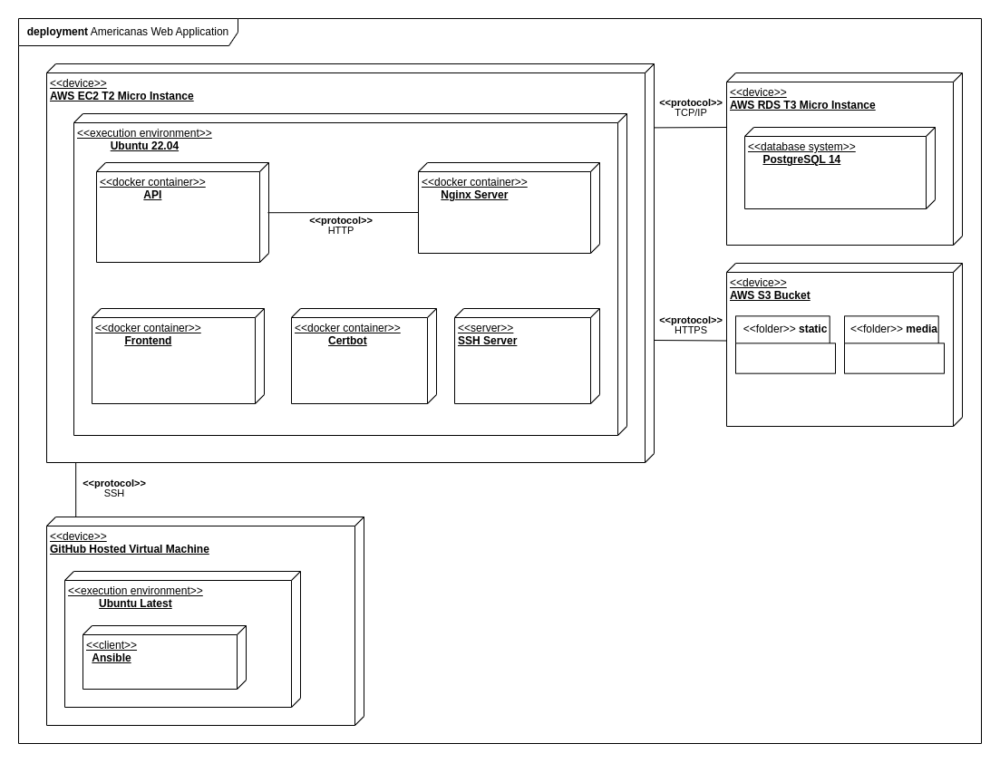
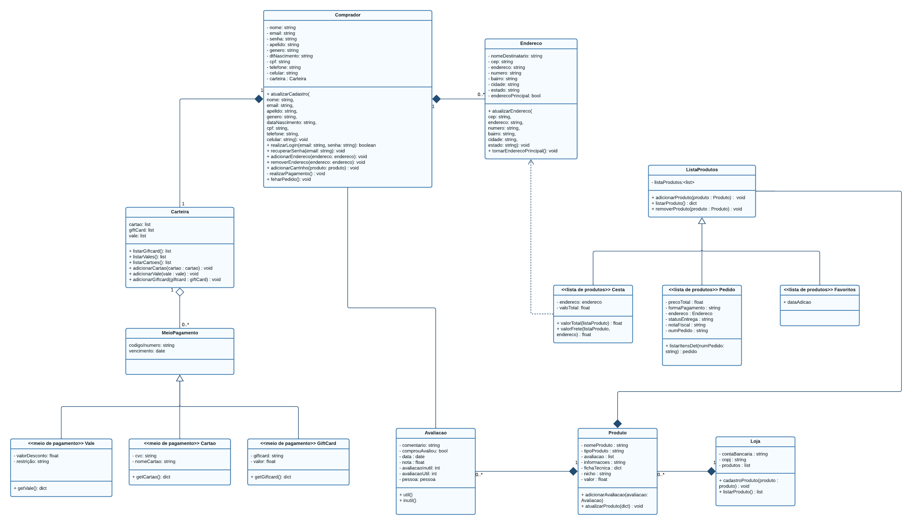
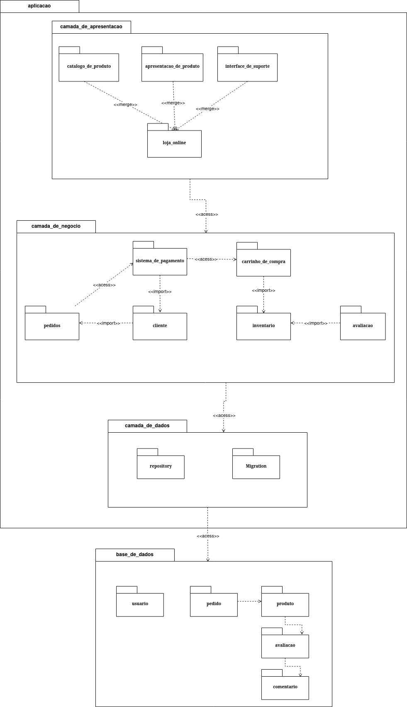
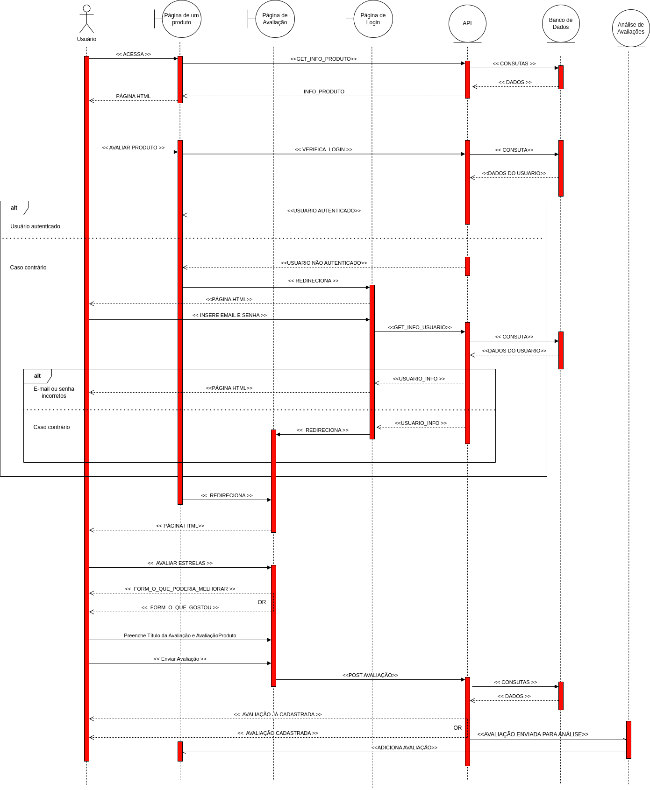

# Documento de arquitetura de software

## 1. Introdução

O Documento de Arquitetura de Software proporciona uma visão completa do panorama específico da Americanas, abrangendo seu propósito, escopo, definições, siglas, abreviações, referências e uma síntese abrangente do conteúdo contido nele. Essencialmente, busca oferecer uma compreensão global e detalhada da arquitetura do software, destacando as decisões cruciais tomadas e explorando várias perspectivas arquitetônicas para esclarecer os diversos elementos do sistema da Americanas em análise.

## 2. Visão de Processo

A visão de processos na arquitetura de sistemas de software oferece um entendimento detalhado de como os processos e tarefas são estruturados e interagem. Essa perspectiva visa identificar os processos-chave do sistema, compreendendo sua comunicação, coordenação e compartilhamento de recursos. É fundamental para modelar a interação entre componentes e módulos em direção aos objetivos do sistema.

Essa abordagem permite mapear as entradas, saídas e fluxos de informação no software, delineando as responsabilidades de cada componente. Ao ser incorporada no Documento de Arquitetura de Software (DAS), essa visão facilita a análise de desempenho, a identificação de gargalos e a otimização do fluxo de trabalho. Essa análise aprofundada garante eficiência, escalabilidade e facilidade de manutenção do software, fortalecendo sua robustez e adaptabilidade às necessidades do negócio.

## 3. Visão de Dados

&emsp;&emsp;   A perspectiva da Visão de Dados se focaliza na estrutura e organização dos dados persistentes empregados pelo sistema, delineando a forma como os dados são armazenados, acessados e manipulados, abrangendo entidades de dados, seus atributos e interconexões.

###  Modelo Entidade-Relacionamento (ME-R)

&emsp;&emsp;A abordagem do Modelo Entidade-Relacionamento (MER) constitui um tipo de modelo de dados aplicado para representar a estrutura e as relações entre as entidades de um sistema. Este modelo proporciona uma representação das entidades, seus atributos e as conexões entre elas.

&emsp;&emsp;No contexto do modelo Entidade-Relacionamento, as entidades são simbolizadas por retângulos, enquanto os relacionamentos são representados por linhas que conectam essas entidades. Cada entidade detém atributos que especificam suas características particulares. A seguir, apresentamos o nosso modelo, que foi elaborado utilizando a ferramenta [brModelo](http://www.sis4.com/brModelo/index.html).

### Entidades

- USUARIO
- ENDERECO_USUARIO
- PEDIDO
- PRODUTO
- ENDERECO
- AVALIACAO

### Descrição das Entidades

- USUARIO ( id_usuario, telefone ,name, email, apelido, cpf, data_nascimento, senha, dt_criacao  )
- ENDERECO_USUARIO ( id_usuario, id_endereco, endereco_padrao , dt_criacao)
- PEDIDO (id_pedido, reputation, data_pedido, status_pedido, detalhes_pedido, preco_total, quantidade, estoque, dt_criacao)
- PRODUTO ( id_produto, categoria, nome, tipo, preco, desconto, dt_criacao)
- ENDERECO (id_produto, rua, cidade, cep, complemento, numero, estado, dt_criacao)
- AVALIACAO(id_avaliacao, id_avaliacao, titulo_avalicao, comentario_avaliacao, dt_criacao)

### Descrição dos relacionamentos

- PRODUTO **- tem -** AVALIACAO  

  Um PRODUTO pode ter nenhuma ou várias AVALIACAOs, e uma AVALIACAO pertence a um único  PRODUTO.

  Cardinalidade: **(1:n)**

- USUARIO **- possui -** ENDERECO_USUARIO 
  Um USUARIO possui um ou mais ENDERECO_USUARIOs, e um ENDERECO_USUARIO pertence a um único USUARIO.

  Cardinalidade: **(1:n)**

- USUARIO **- faz-** PEDIDO 
  Um USUARIO pode fazer nenhum ou vários PEDIDOs, mas um PEDIDO pertence a um único USUARIO.

  Cardinalidade: **(1:n)**

- ENDERECO_USUARIO **- contem -** ENDERECO  
    Um ENDERECO_USUARIO pode conter um ENDERECO, e um ENDERECO pertence a nenhum ou vários ENDERECO_USUARIO.

    Cardinalidade: **(n:1)**

- PEDIDO **- contem -** PRODUTO 
  Um PEDIDO pode contem nenhum ou vários PRODUTOs, e um PRODUTO pode ser de um ou vários PEDIDOs.
  
  Cardinalidade: **(n:m)**

### 3.1 Diagrama Entidade-Relacionamento (DE-R)

<figcaption align='center'>
    <b>Figura ...: Diagrama Entidade-Relacionamento (DE-R)</b>
     <small>Fonte: Criação própria</small>
</figcaption> 

### 3.2 Diagrama Lógico de Dados (DLD)

<figcaption align='center'>
    <b>Figura ...: Diagrama Lógico de Dados (DLD)</b>
     <small>Fonte: Criação própria</small>
</figcaption> 

## 4. Visão de Casos de Uso

&emsp;&emsp;   Um modelo de caso de uso é um modelo que descreve como diferentes tipos de usuários interagem com o sistema para resolver um problema. Como tal, ele descreve as metas dos usuários, as interações entre os usuários e o sistema, bem como o comportamento necessário do sistema para satisfazer estas metas. Um modelo de caso de uso consiste em um conjunto de 
elementos de modelo. Os elementos de modelo mais importantes são: casos de uso, atores e as relações entre eles.

&emsp;&emsp;  Ao criar uma visão arquitetural de casos de uso, os arquitetos de software podem visualizar e comunicar de forma clara como o sistema irá atender às necessidades dos usuários, facilitando a tomada de decisões arquiteturais e o alinhamento entre os requisitos e o design do sistema.

### 4.1 Tabelas e diagrama de casos de uso

### Atores

| Número  |                       Ator                            |                   Descrição                                      | 
| :----:  | :---------------------------------------------------: | :--------------------------------------------------------------: | 
|    1    |                      Comprador	                      |  Usuário comprador de produtos e avaliador no site da Americanas |
|    2    |                      plataforma                       |  Usuário vendedor de produtos, sendo a própia plataforma         |

#### Tabela 1: Atores Caso de Uso
Fonte: Criação própria

### Tabela de itens

|  Código   |    Descrição       |    
|  :------: | :----------------: | 
|   US01    | Vende produto      |
|   US02    | Compra produto     |
|   US03    | Visualiza produto  |
|   US04    | Realiza avaliação  |
|   US05    | avaliação baixa    |
|   US06    | avaliação alta     |
|   US07    | realiza comentário |
|   US08    | visuliza avaliação |
|   US09    | filtra avaliações  |
|   US010   | avalia avaliações  |
|   US011   | realiza perguntas  |
|   US012   | responde perguntas |

#### Tabela 2: Código e Descrição
Fonte: Criação própria

### Tabela de dependências

|    Relação   |    Tipo   |    
|  :---------: | :-------: | 
|   US05xUS07  | INCLUD    |
|   US05xUS07  | EXTEND    |

### Diagrama de Caso de Uso

## 5. Visão de Implantação

Esta visão fornece uma visão geral de como o sistema deste projeto deve ser implantado. Também mostra os objetivos e as limitações relacionadas à implantação. 

Foi utilizada somente uma visão de implantação, suficiente para não deixar dúvidas quanto a como deve ser feito o “deploy” do sistema em questão. Tal visão é o diagrama UML de implantação. Mostra como as máquinas, as máquinas virtuais e os contêineres interagem entre si.

### 5.1 Objetivos e Limitações

As principais limitações foram de tempo e de dinheiro. O objetivo do time foi entregar o sistema funcionando dentro do prazo, garantindo a segurança de recursos computacionais e a privacidade das informações de usuários. No documento denominado ["Diagrama de Implantação"](https://unbarqdsw2023-2.github.io/2023.2_G5_ProjetoAmericanas/#/Modelagem/2.1.1.3.DiagramaDeComponentes), pode ser conferido com mais detalhes como foram escolhidas as tecnologias e os dispositivos utilizados, e também pode ser conferido quais fatores foram levados em conta nessas escolhas.

### 5.2 Relação com o diagrama de caso de uso da seção 3.1

Ao fazer uma avaliação, um usuário pode fazer o upload de texto e de imagens por meio do frontend (React). Tais requisições de upload são enviadas para o proxy reverso (Nginx), que encaminha para o backend (Django REST Framework). O backend, por sua vez, solicita o armazenamento de tais dados ao AWS S3 e ao servidor PostgreSQL. As imagens são armazenadas no AWS S3, uma referência a cada uma dessas imagens vai para o PostgreSQL, e os demais textos são armazenados no PostgreSQL.

### 5.3 Diagrama de Implantação

 

 

## 6. Visão lógica

&emsp;&emsp; A visão lógica de um documento arquitetural de software descreve a estrutura interna do sistema e como seus diferentes componentes se relacionam entre si de forma lógica. Essa visão tem como objetivo principal fornecer uma representação abstrata do sistema, destacando os principais elementos funcionais e suas interações. É essencial para que os desenvolvedores, arquitetos de software e outros stakeholders compreendam a estrutura e o funcionamento interno do sistema, facilitando o desenvolvimento, a manutenção e a evolução do software ao longo do tempo.

### 6.1 Visão Geral

&emsp;&emsp; A visão lógica na arquitetura de software se refere a uma perspectiva específica utilizada para compreender a estrutura e o funcionamento de um sistema de software. Essa visão concentra-se nas regras de negócio, nos processos e na lógica subjacente que orientam o comportamento do sistema.

### 6.2 Pacotes de design arquitetonicamente significativos

&emsp;&emsp; Para o nosso projeto utilizamos a visão lógica nos seguintes diagramas

#### Diagrama de Classe

 

Diagrama de classes Autor: Elaboração Própria

 

&emsp;&emsp; No processo de desenvolvimento do sistema para a Americanas, foi utilizado a ferramenta Lucidchart para criar um diagrama de classe UML que representa os principais componentes do sistema, focando no Perfil de Comprador, na Plataforma e nos fluxos relacionados às avaliações de produtos. Por esse diagrama é capaz de se perceber os relacionamentos de cada classe, permitindo uma melhor compreensão do funcionamento interno do sistema, tendo em vista como principais classes, comprador, loja e produtos.

#### Diagrama de Pacotes

 
 

Diagrama de Pacodes V2 Autor: Elaboração Própria

 

&emsp;&emsp;  No processo de desenvolvimento do sistema para a Americanas, foi utilizado a ferramenta Draw.io para criar um diagrama de pacotes para prover uma visualização em escala mais alta do sistema, assim como a estrura arquitetural e as dependências de cada camada. Os responáveis pela criação do digrama primeiramente modelaram individualmente e depois analisaram as duas modelagem e escolheram a que acharam que melhor representava o sistema a nível de pacote. A seguir foi feito debates sobre a modelagem e aprimoramentos que deveriam ser feito. Apartir desse diagrama podemos compreender melhor a arquitetura do sistema e o relacionamento de alguns de seus componentes em um nível mais amplo que o visto no diagrama de classes.

#### Diagrama de Sequência

 

 

&emsp;&emsp; Foi desenvolvido um diagrama de sequência que descreve o fluxo de avaliação de produtos no site das Americanas,  utilizando a ferramenta Lucidchart. Isso envolveu a análise de requisitos, a identificação de atores como usuário e sistema, e a compreensão dos eventos relacionados à avaliação de produtos. Em seguida, foi criado o diagrama, mapeando visualmente os passos do processo no Lucidchart e definindo objetos como a API, banco de dados de produtos e usuário. 

## . Histórico de versão

| Versão |                       Alteração                       |                   Responsável                   | Revisor | Data  |
| :----: | :---------------------------------------------------: | :---------------------------------------------: | :-----: | :---: |
|  1.0   |              Criação do documento e visão de dados    | Philipe de Sousa                                | Pedro   | 28/11 |
|  1.1   |              Ajuste nos diagramas DER e DLD           | Philipe de Sousa                          | Felipe Pereira| 28/11 |
|  2.0   |             Criação da Visões de Caso de uso          |       Silas Neres                               | Felipe Pereira | 30/11|
|  3.0   |             Adicionar Visão de Implantação            | Leonardo Miranda                                | Silas Neres | 30/11 |
|  4.0   |            Adicionar Visão Lógica                     | Silas Neres                                     | Pablo    | 01/12 |
|  5.0   |            Adicionar Visão de Processo                     | Fellipe Pereira                                   | Pablo    | 01/12 |

##  Referências

> [1] Fakhroutdinov, K.: The Unified Modeling Language site,
Actions, 2009–2023. Disponível em: https://www.uml-diagrams.org/component-diagrams.html . Acesso em: 30 de Novembro de 2023.
