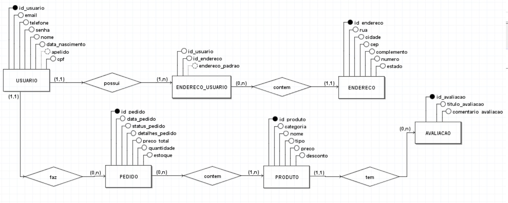
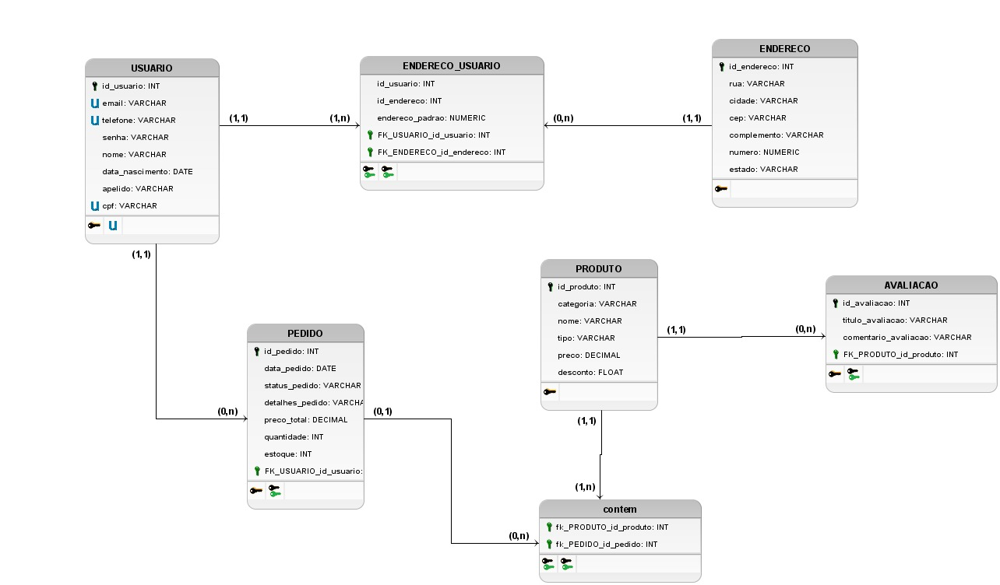

# Documento de arquitetura de software

## 1. Introdução

## 2. Visão de Dados

&emsp;&emsp;   A perspectiva da Visão de Dados se focaliza na estrutura e organização dos dados persistentes empregados pelo sistema, delineando a forma como os dados são armazenados, acessados e manipulados, abrangendo entidades de dados, seus atributos e interconexões.

###  Modelo Entidade-Relacionamento (ME-R)

&emsp;&emsp;A abordagem do Modelo Entidade-Relacionamento (MER) constitui um tipo de modelo de dados aplicado para representar a estrutura e as relações entre as entidades de um sistema. Este modelo proporciona uma representação das entidades, seus atributos e as conexões entre elas.

&emsp;&emsp;No contexto do modelo Entidade-Relacionamento, as entidades são simbolizadas por retângulos, enquanto os relacionamentos são representados por linhas que conectam essas entidades. Cada entidade detém atributos que especificam suas características particulares. A seguir, apresentamos o nosso modelo, que foi elaborado utilizando a ferramenta [brModelo](http://www.sis4.com/brModelo/index.html).

### Entidades

- USUARIO
- ENDERECO_USUARIO
- PEDIDO
- PRODUTO
- ENDERECO
- AVALIACAO

### Descrição das Entidades

- USUARIO ( id_usuario, telefone ,name, email, apelido, cpf, data_nascimento, senha  )
- ENDERECO_USUARIO ( id_usuario, id_endereco, endereco_padrao )
- PEDIDO (id_pedido, reputation, data_pedido, status_pedido, detalhes_pedido, preco_total, quantidade, estoque)
- PRODUTO ( id_produto, categoria, nome, tipo, preco, desconto)
- ENDERECO (id_produto, rua, cidade, cep, complemento, numero, estado)
- AVALIACAO(id_avaliacao, id_avaliacao, titulo_avalicao, comentario_avaliacao)

### Descrição dos relacionamentos

- PRODUTO **- tem -** AVALIACAO  

  Um PRODUTO pode ter nenhuma ou várias AVALIACAOs, e uma AVALIACAO pertence a um único  PRODUTO.

  Cardinalidade: **(1:n)**

- USUARIO **- possui -** ENDERECO_USUARIO 
  Um USUARIO possui um ou mais ENDERECO_USUARIOs, e um ENDERECO_USUARIO pertence a um único USUARIO.

  Cardinalidade: **(1:n)**

- USUARIO **- faz-** PEDIDO 
  Um USUARIO pode fazer nenhum ou vários PEDIDOs, mas um PEDIDO pertence a um único USUARIO.

  Cardinalidade: **(1:n)**

- ENDERECO_USUARIO **- contem -** ENDERECO  
    Um ENDERECO_USUARIO pode conter um ENDERECO, e um ENDERECO pertence a nenhum ou vários ENDERECO_USUARIO.

    Cardinalidade: **(n:1)**

- PEDIDO **- contem -** PRODUTO 
  Um PEDIDO pode contem nenhum ou vários PRODUTOs, e um PRODUTO pode ser de um ou vários PEDIDOs.
  
  Cardinalidade: **(n:m)**

### 2.1 Diagrama Entidade-Relacionamento (DE-R)

<figcaption align='center'>
    <b>Figura ...: Diagrama Entidade-Relacionamento (DE-R)</b>
     <small>Fonte: Criação própria</small>
</figcaption> 

### 2.2 Diagrama Lógico de Dados (DLD)

<figcaption align='center'>
    <b>Figura ...: Diagrama Lógico de Dados (DLD)</b>
     <small>Fonte: Criação própria</small>
</figcaption> 

## . Histórico de versão

| Versão |                       Alteração                       |                   Responsável                   | Revisor | Data  |
| :----: | :---------------------------------------------------: | :---------------------------------------------: | :-----: | :---: |
|  1.0   |              Criação do documento e visão de dados             | Philipe de Sousa| Pedro e Fellipe  | 28/11 |

##  Referências
