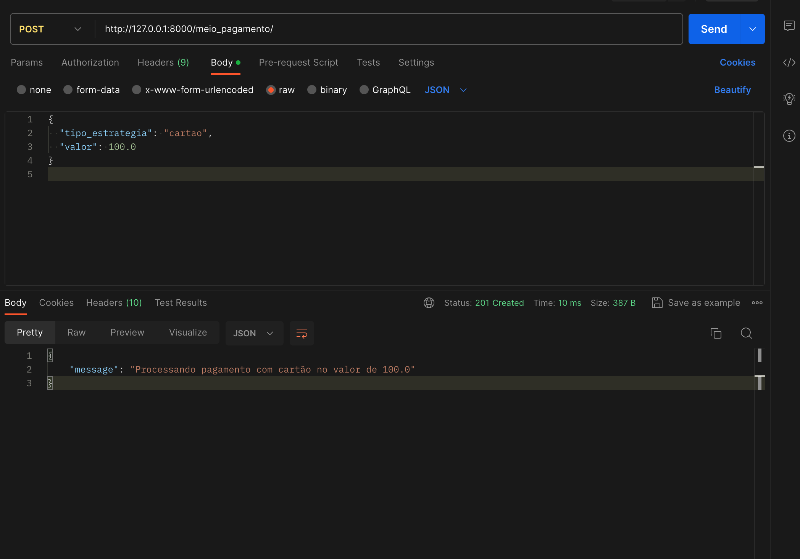

# 4.2.1 Padrão Strategy

O Strategy é um padrão de projeto comportamental que permite que você defina uma família de algoritmos, coloque-os em classes separadas, e faça os objetos deles intercambiáveis.

## 1. Versionamento

| Versão |                      Alteração                      |    Responsável     |      Revisor       | Data  |
| :----: | :-------------------------------------------------: | :----------------: | :----------------: | :---: |
|  1.0   |  Criação do documento   | [Pedro Vitor Augusto de Jesus](https://github.com/peedrooo)  | [José Luis Teixeira](https://github.com/joseluis-rt) | 30/11/2023 |

## 2. Problema

Imagine inicialmente que as Lojas Americanas ofereçam apenas pagamentos via cartão de crédito. Isso significa que toda a lógica de processamento de pagamento, verificação de cartão, cobrança e afins está integrada diretamente no código responsável pela finalização das compras.

Agora, suponha que a empresa deseje expandir as opções de pagamento para incluir:

Pagamentos com vales exclusivos das Lojas Americanas: Oferecendo descontos especiais ou vantagens para clientes frequentes.

Pagamentos com gift cards: Permitindo que os clientes paguem com cartões de presente de outras empresas.

Problemas sem a utilização do padrão Strategy:

Código Monolítico e Acoplamento Forte: A lógica de pagamento para cartão de crédito estaria profundamente integrada na estrutura do sistema. Adicionar novos métodos de pagamento implicaria modificar diretamente esse código existente, aumentando a complexidade e o risco de introduzir bugs.

Dificuldade de Manutenção e Escalabilidade: Cada novo método de pagamento exigiria modificações extensas no código existente, tornando o sistema mais difícil de entender, manter e expandir. Isso poderia levar a um código propenso a erros e dificuldades na incorporação de futuras mudanças ou adições.

Limitação na Adição de Novos Métodos: A falta de flexibilidade na estrutura do código dificultaria a adição de novos métodos de pagamento de forma rápida e eficiente. Isso poderia resultar em atrasos na implementação de novos recursos de pagamento, prejudicando a experiência do cliente e reduzindo a competitividade da empresa no mercado.

Maior Tempo de Desenvolvimento e Testes: Cada nova integração de método de pagamento exigiria tempo adicional para desenvolvimento, testes extensivos e verificação de compatibilidade com o sistema existente.

Em resumo, sem a implementação do padrão Strategy, as Lojas Americanas enfrentariam sérios desafios na incorporação de novos métodos de pagamento, resultando em um sistema menos flexível, mais propenso a erros e com dificuldades na manutenção e expansão. Isso poderia afetar negativamente a experiência do cliente e a competitividade da empresa no mercado.

## 3. Solução

O padrão Strategy sugere que você pegue uma classe que faz algo específico em diversas maneiras diferentes e extraia todos esses algoritmos para classes separadas chamadas estratégias.

A classe original, chamada carteira, deve ter um campo para armazenar uma referência para um dessas estratégias. O contexto delega o trabalho para um objeto estratégia ao invés de executá-lo por conta própria.

O contexto não é responsável por selecionar um algoritmo apropriado para o trabalho. Ao invés disso, o cliente passa a estratégia desejada para o contexto. Na verdade, o contexto não sabe muito sobre as estratégias. Ele trabalha com todas elas através de uma interface genérica, que somente expõe um único método para acionar o algoritmo encapsulado dentro da estratégia selecionada.

Desta forma o contexto se torna independente das estratégias concretas, então você pode adicionar novos algoritmos ou modificar os existentes sem modificar o código do contexto ou outras estratégias.


## 4. Modelagem


## 5. Código

```java
// Carteira.java
public class Carteira {
    private MeioPagamento estrategiaPagamento;

    public void setEstrategiaPagamento(MeioPagamento meioPagamento) {
        this.estrategiaPagamento = meioPagamento;
    }

    public void pagamentoAbate(float valor) {
        this.estrategiaPagamento.pagamento(valor);
    }
}

// MeioPagamento.java
public interface MeioPagamento {
    void pagamento(float valor);
}


// EstrategiaPagamentoCartao.java
public class EstrategiaPagamentoCartao implements MeioPagamento {
    private String cvc;
    private String nomeCartao;

    public EstrategiaPagamentoCartao(String cvc, String nomeCartao) {
        this.cvc = cvc;
        this.nomeCartao = nomeCartao;
    }

    @Override
    public void pagamento(float valor) {
        // Lógica de pagamento com cartão
        System.out.println("Pagamento com cartão de " + nomeCartao);
    }
}


// EstrategiaPagamentoVale.java
public class EstrategiaPagamentoVale implements MeioPagamento {
    private float valorDesconto;
    private String restricao;

    public EstrategiaPagamentoVale(float valorDesconto, String restricao) {
        this.valorDesconto = valorDesconto;
        this.restricao = restricao;
    }

    @Override
    public void pagamento(float valor) {
        // Lógica de pagamento com vale
        System.out.println("Pagamento com vale. Desconto aplicado: " + valorDesconto);
    }
}


// EstrategiaPagamentoGiftCard.java
public class EstrategiaPagamentoGiftCard implements MeioPagamento {
    private String giftcard;
    private float valor;

    public EstrategiaPagamentoGiftCard(String giftcard, float valor) {
        this.giftcard = giftcard;
        this.valor = valor;
    }

    @Override
    public void pagamento(float valor) {
        // Lógica de pagamento com giftcard
        System.out.println("Pagamento com giftcard de valor " + this.valor);

    }
}

```

```python
from abc import ABC, abstractmethod
from django.db import models

# Interface para a estratégia de pagamento
class MeioPagamentoStrategy(ABC):
    @abstractmethod
    def processar_pagamento(self, valor):
        pass

# Estratégia concreta para pagamento com cartão
class PagamentoCartaoStrategy(MeioPagamentoStrategy):
    def processar_pagamento(self, valor):
        # Lógica específica para pagamento com cartão
        print(f"Processando pagamento com cartão no valor de {valor}")
        return {'message': f'Processando pagamento com cartão no valor de {valor}'}

# Estratégia concreta para pagamento com vale
class PagamentoValeStrategy(MeioPagamentoStrategy):
    def processar_pagamento(self, valor):
        # Lógica específica para pagamento com vale
        print(f"Processando pagamento com vale no valor de {valor}")
        return {'message': f'Processando pagamento com vale no valor de {valor}'}

# Estratégia concreta para pagamento com gift card
class PagamentoGiftCardStrategy(MeioPagamentoStrategy):
    def processar_pagamento(self, valor):
        # Lógica específica para pagamento com gift card
        print(f"Processando pagamento com gift card no valor de {valor}")
        return {'message': f'Processando pagamento com gift card no valor de {valor}'}

```



## 6. Bibliografia

> [1] "Strategy" Refactoring Guru. Disponível em: https://refactoring.guru/pt-br/design-patterns/strategy . Acesso em: 30 de novembro de 2023.

