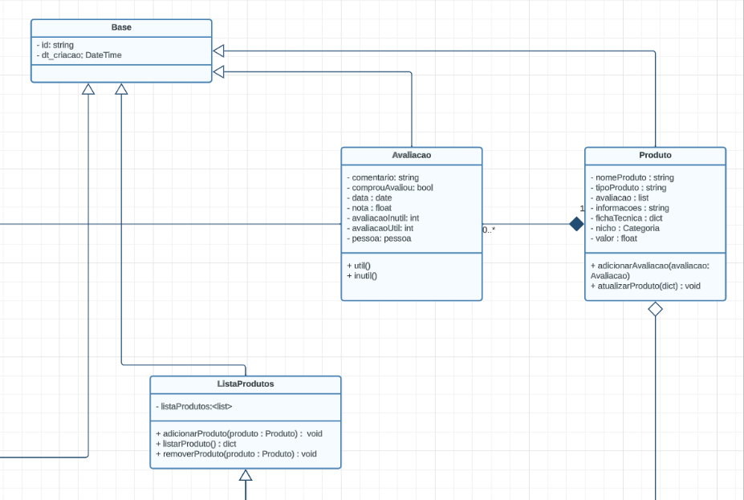
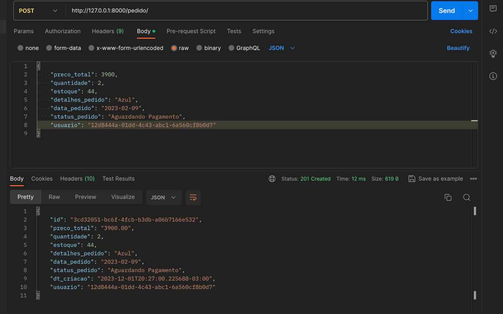

# 4.2.2 Padrão Template Method

O Template Method é um padrão de projeto comportamental que define a estrutura de um algoritmo em uma classe base, mas deixa alguns passos específicos do algoritmo para serem implementados pelas subclasses. Ele permite que as subclasses redefinam certos passos de um algoritmo sem alterar sua estrutura.

## 1. Versionamento

| Versão |                      Alteração                      |    Responsável     |      Revisor       | Data  |
| :----: | :-------------------------------------------------: | :----------------: | :----------------: | :---: |
|  1.0   |  Criação do documento   | [Fellipe Pereira da Costa Silva](https://github.com/fellipepcs)  | [José Luis Teixeira](https://github.com/joseluis-rt) | 01/12/2023 |


## 2. Problema

Inicialmente, a Americanas só oferece a opção de avaliação com campos como título, comentário, nota, e está integrado diretamente ao código responsável pela manipulação dessas avaliações.

Agora, suponha que a empresa deseje expandir as opções de avaliação para incluir:

Avaliações com anexos de imagens: Permitindo que os clientes enviem imagens junto com suas avaliações.
Avaliações com feedback detalhado: Oferecendo aos clientes a opção de fornecer um feedback mais detalhado sobre sua experiência com o produto.
Problemas sem a utilização do padrão Template Method:

Código Monolítico e Acoplamento Forte: A lógica de processamento de avaliações estaria profundamente integrada na estrutura do sistema. Adicionar novos tipos de avaliação implicaria modificar diretamente esse código existente, aumentando a complexidade e o risco de introduzir bugs.

Dificuldade de Manutenção e Escalabilidade: Cada novo tipo de avaliação exigiria modificações extensas no código existente, tornando o sistema mais difícil de entender, manter e expandir. Isso poderia levar a um código propenso a erros e dificuldades na incorporação de futuras mudanças ou adições.

Limitação na Adição de Novos Tipos: A falta de flexibilidade na estrutura do código dificultaria a adição de novos tipos de avaliação de forma rápida e eficiente. Isso poderia resultar em atrasos na implementação de novos recursos de avaliação, prejudicando a experiência do cliente e reduzindo a competitividade da empresa no mercado.

Maior Tempo de Desenvolvimento e Testes: Cada nova integração de tipo de avaliação exigiria tempo adicional para desenvolvimento, testes extensivos e verificação de compatibilidade com o sistema existente.

Em resumo, sem a implementação do padrão Template Method, a empresa enfrentaria sérios desafios na incorporação de novos tipos de avaliação, resultando em um sistema menos flexível, mais propenso a erros e com dificuldades na manutenção e expansão. Isso poderia afetar negativamente a experiência do cliente e a competitividade da empresa no mercado.


## 3. Solução

O padrão Template Method sugere que você defina a estrutura geral de um algoritmo em uma classe base, com métodos ou atributos "gancho" que podem ser implementados pelas subclasses para personalizar partes específicas do algoritmo.

A classe base contém um método principal chamado "template method" que coordena a execução do algoritmo, chamando os métodos ou atributos gancho e os métodos ou atributos comuns. Os métodos gancho são opcionais e podem ser sobrescritos pelas subclasses para fornecer implementações específicas.

## 4. Modelagem



## 5. Código

```python
import uuid

from django.db import models


class Base(models.Model):
    id = models.CharField(primary_key=True, default=uuid.uuid4, max_length=40)
    dt_criacao = models.DateTimeField(auto_now_add=True)

    class Meta:
        abstract = True
```

Exemplo aplicado abaixo na classe de pedidos.

```python
from django.db import models
from abstract_factory.base_model import Base
from americanas.models import Usuario


class Pedido(Base):
    data_pedido = models.DateField()
    status_pedido = models.CharField(max_length=100)
    detalhes_pedido = models.CharField(max_length=100)
    preco_total = models.DecimalField(max_digits=10, decimal_places=2)
    quantidade = models.IntegerField()
    estoque = models.IntegerField()
    usuario = models.OneToOneField(Usuario, on_delete=models.CASCADE, db_column='id_usuario')
    
    class Meta:
        db_table = 'pedido'
```



## 6. Acesso:

Para acesso e realizar requisição, basta acessar essa url:
https://54.233.104.106.sslip.io/api/pedido/

Caso queira ver o codigo implementado. Clique nesse link: 
[Código base](../../backend/template_method/base_model.py)

Abaixo codigo implementado, usando o a classe base acima.
[Código implementado](../../backend/americanas/models/Usuario.py)


## 7. Bibliografia

> [1] "Template Method" Refactoring Guru. Disponível em: https://refactoring.guru/pt-br/design-patterns/template-method . Acesso em: 01 de dezembro de 2023.

