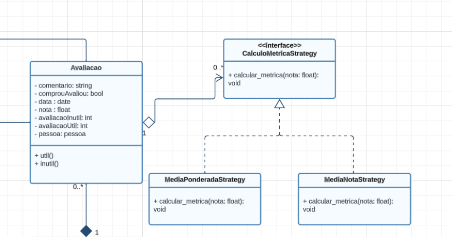
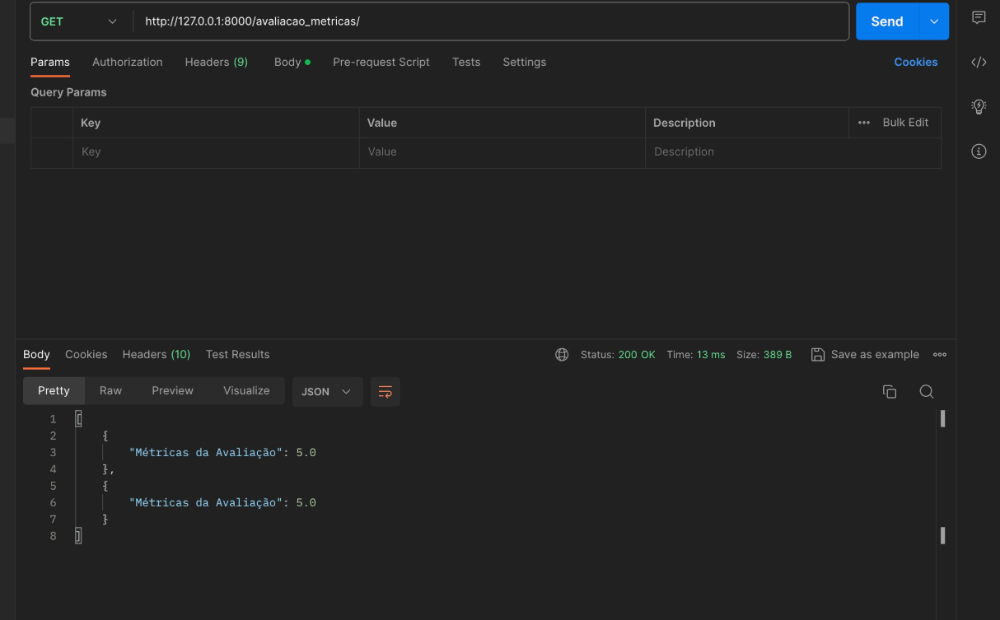

# 4.2.3 Padrão Strategy

O Strategy é um padrão de projeto comportamental que permite que você defina uma família de algoritmos, coloque-os em classes separadas, e faça os objetos deles intercambiáveis.

## 1. Versionamento

| Versão |                      Alteração                      |    Responsável     |      Revisor       | Data  |
| :----: | :-------------------------------------------------: | :----------------: | :----------------: | :---: |
|  1.0   |  Criação do documento   | [Fellipe Pereira da Costa Silva](https://github.com/fellipepcs)  | [José Luis Teixeira](https://github.com/joseluis-rt) | 01/12/2023 |


## 2. Problema

Imagine que a Americanas ofereça inicialmente apenas uma forma de calcular métricas de avaliação, como a média ponderada. Esse cálculo está integrado diretamente ao código responsável pela manipulação das avaliações.

Agora, suponha que a empresa deseje expandir as opções de cálculo de métricas para incluir:

Métricas personalizadas para diferentes tipos de produtos: Cada tipo de produto pode ter um método específico de calcular métricas.
Métricas dinâmicas com base em eventos especiais: Por exemplo, durante uma promoção, a métrica pode ser calculada de maneira diferente.
Problemas sem a utilização do padrão Strategy:

Código Monolítico e Acoplamento Forte: A lógica de processamento de métricas estaria profundamente integrada na estrutura do sistema. Adicionar novos métodos de cálculo implicaria modificar diretamente esse código existente, aumentando a complexidade e o risco de introduzir bugs.

Dificuldade de Manutenção e Escalabilidade: Cada novo método de cálculo exigiria modificações extensas no código existente, tornando o sistema mais difícil de entender, manter e expandir. Isso poderia levar a um código propenso a erros e dificuldades na incorporação de futuras mudanças ou adições.

Limitação na Adição de Novos Métodos: A falta de flexibilidade na estrutura do código dificultaria a adição de novos métodos de cálculo de métricas de forma rápida e eficiente. Isso poderia resultar em atrasos na implementação de novos recursos de métricas, prejudicando a experiência do cliente e reduzindo a competitividade da empresa no mercado.

Maior Tempo de Desenvolvimento e Testes: Cada nova integração de método de cálculo exigiria tempo adicional para desenvolvimento, testes extensivos e verificação de compatibilidade com o sistema existente.

Em resumo, sem a implementação do padrão Strategy, a empresa enfrentaria sérios desafios na incorporação de novos métodos de cálculo de métricas, resultando em um sistema menos flexível, mais propenso a erros e com dificuldades na manutenção e expansão. Isso poderia afetar negativamente a experiência do cliente e a competitividade da empresa no mercado.

## 3. Solução

O padrão Strategy sugere que você pegue uma classe que faz algo específico de várias maneiras diferentes e extraia todos esses algoritmos para classes separadas chamadas estratégias.

A classe original, chamada CalculadoraMetrica, deve ter um campo para armazenar uma referência para uma dessas estratégias. O contexto delega o trabalho para um objeto estratégia em vez de executá-lo por conta própria.

O contexto não é responsável por selecionar um algoritmo apropriado para o trabalho. Em vez disso, o cliente passa a estratégia desejada para o contexto. Na verdade, o contexto não sabe muito sobre as estratégias. Ele trabalha com todas elas por meio de uma interface genérica, que expõe apenas um único método para acionar o algoritmo encapsulado dentro da estratégia selecionada.

Desta forma, o contexto se torna independente das estratégias concretas, permitindo adicionar novos algoritmos ou modificar os existentes sem modificar o código do contexto ou outras estratégias.

## 4. Modelagem


## 5. Código

```python
from abc import ABC, abstractmethod
# Interface para a estratégia de cálculo de métricas
class CalculoMetricaStrategy(ABC):
    @abstractmethod
    def calcular_metrica(self, avaliacao):
        pass

# Estratégia concreta para calcular a média ponderada
class MediaPonderadaStrategy(CalculoMetricaStrategy):
    def calcular_metrica(self, avaliacao):
        peso = 1  # Defina o peso conforme necessário
        return (avaliacao.nota * peso) / peso
    
class MediaNotaStrategy(CalculoMetricaStrategy):
    def calcular_metrica(self, avaliacao, quantidade_avaliacoes):
        return avaliacao.nota / quantidade_avaliacoes

# Classe que utiliza a estratégia para calcular a métrica
class CalculadoraMetrica:
    def __init__(self, estrategia):
        self.estrategia = estrategia

    def calcular(self, avaliacao):
        return self.estrategia.calcular_metrica(avaliacao)

```
Implementação na service abaixo:

```python 
from americanas.models import CalculadoraMetrica
from americanas.models import MediaPonderadaStrategy


def calcular_metrica(self):
    # Crie uma instância da CalculadoraMetrica com a estratégia desejada
    calculadora = CalculadoraMetrica(MediaPonderadaStrategy())

    # Utilize a estratégia para calcular a métrica
    return calculadora.calcular(self)
```



## 6. Acesso:

Para acesso e realizar requisição, basta acessar essa url:
https://18.231.183.136.sslip.io/api/avaliacao_metricas/

Caso queira ver o codigo implementado. Clique nesse link: 
[Código base](../../backend/strategy/base_strategy.py)

Abaixo codigo implementado, usando o a classe base acima.
[Código implementado](../../backend/americanas/services/AvaliacaoService.py)

## 7. Bibliografia

> [1] "Strategy" Refactoring Guru. Disponível em: https://refactoring.guru/pt-br/design-patterns/strategy . Acesso em: 01 de dezembro de 2023.
