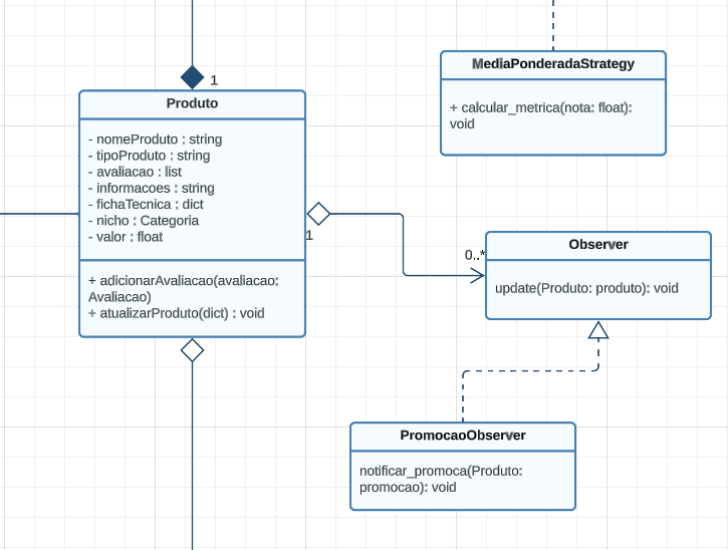
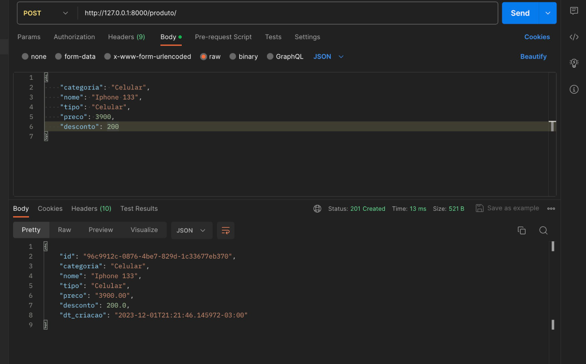

# 4.2.2 Padrão Observer
O Observer é um padrão de projeto comportamental que define uma dependência de um para muitos entre objetos, de modo que quando um objeto muda de estado, todos os seus dependentes são notificados e atualizados automaticamente.

## 1. Versionamento

| Versão |                      Alteração                      |    Responsável     |      Revisor       | Data  |
| :----: | :-------------------------------------------------: | :----------------: | :----------------: | :---: |
|  1.0   |  Criação do documento   | [Fellipe Pereira da Costa Silva](https://github.com/fellipepcs)  | [José Luis Teixeira](https://github.com/joseluis-rt) | 01/12/2023 |


## 2. Problema

A Americanas, inicialmente, tem um mecanismo para notificar automaticamente os clientes sobre novas promoções. A lógica de notificação está integrada diretamente ao código responsável pela criação das promoções.

Agora, suponha que a empresa deseje implementar um sistema em que os clientes se inscrevam para receber notificações sobre promoções específicas.

Problemas sem a utilização do padrão Observer:

Implementação Manual de Notificações: Sem um mecanismo padronizado de notificação, a Americanas precisaria implementar manualmente o código para notificar cada cliente interessado em uma nova promoção. Isso levaria a um código redundante, difícil de manter e propenso a erros.

Acoplamento Forte: A lógica de notificação estaria profundamente integrada à lógica de criação de promoções. Isso resultaria em um sistema com alto acoplamento, onde mudanças em uma parte do código poderiam afetar adversamente outras partes.

Dificuldade de Escalabilidade: À medida que a base de clientes aumenta e novos recursos são adicionados, a falta de um padrão de notificação flexível dificultaria a implementação de um sistema eficiente e escalável.

## 3. Solução
O padrão Observer sugere que você defina uma dependência de um para muitos entre objetos, de modo que quando um objeto (o sujeito) muda de estado, todos os seus dependentes (os observadores) são notificados e atualizados automaticamente.

Os objetos sujeitos mantêm uma lista de seus observadores e fornecem métodos para adicionar, remover e notificar observadores. Os observadores implementam uma interface comum que inclui um método de atualização, chamado pelo sujeito para notificar mudanças.

## 4. Modelagem 



## 5. Código

```python 
from abc import ABC, abstractmethod

class Observer(ABC):
    @abstractmethod
    def update(self, subject, *args, **kwargs):
        pass

```

```python 
from observer import Observer


class PromocaoObserver(Observer):
    def update(self, subject, *args, **kwargs):
        print("Update chamado")
        self.notificar_promocao(subject)

    def notificar_promocao(self, promocao):
        print("Notificar promoção chamado")
        # Lógica para notificar sobre uma nova promoção
        print(f"Nova promoção! {promocao.nome} com desconto de {promocao.desconto}%")

```


## 6. Acesso

Para acesso e realizar requisição, basta acessar essa url:
https://54.233.104.106.sslip.io/api/produto/

Caso queira ver o codigo implementado. Clique nesse link: 
[Código base](../../backend/observer/BaseObserver.py)

Abaixo codigo implementado, usando o a classe base acima.
[Código implementado](../../backend/observer/ProdutoObserver.py)

## 7. Bibliografia

> [1] "Observer" Refactoring Guru. Disponível em: https://refactoring.guru/pt-br/design-patterns/observer . Acesso em: 01 de dezembro de 2023.


