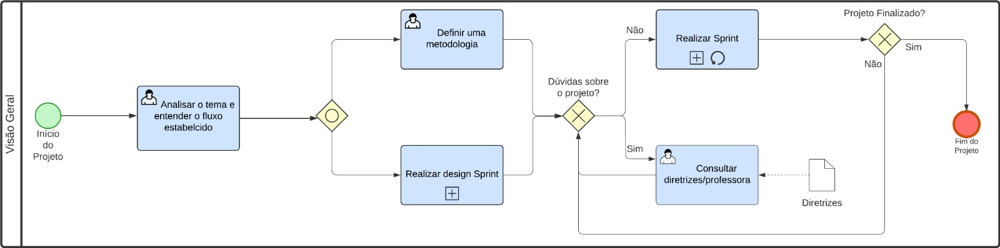

# 1.2. Módulo Processos/Metodologias/Abordagens

## 1.2.1 Introdução

&emsp;&emsp; Esse documento tem como proposto definir as metodologias/abordagens que serão utilizadas no projeto, para tanto faremos uso da modelagem BPMN, para melhor visualização dos processos propotos pelas metogodolias/abordagens. BPMN (Business Process Management Notation) é uma notação padronizada para diagramação de fluxos de um processo.

## 1.2.2 Metodologia

&emsp;&emsp; O grupo decidiu através de uma reúnião, utilizar a metodologia Scrum juntamente com o kanban, o principal motivo para essa decisão foi a experiência da equipe com as metodologias. O Kanban será utilizado para organização e melhor visualisação do andamento das tarefas porpostas a serem feita em cada sprint, enquanto o scrum guiará todo o desenvolvimento do projeto. Além disso, também foi decidido usar uma técnica advinda da metodologia XP (Extreme Programming), que é a programação em pares, a proposta é utilizar essa técnica para dar suporte no desenvolvimento de tarefas mais complexas.

### Scrum

&emsp;&emsp; Trata-se de uma metodologia ágil, onde há grande preocupação em fazer entregas relevantes de maneira eficiente, rápida e organizada, assim possibilitando uma maior tolerância em relação a mudaças que podem ocorrer durante o processo de desenvolvimento. Outros pontos de interesse da equipe em relação a abordagem, é potencializar o trabalho em equipe de maneira orgânica em relação ao cumprimento dos prazos estipulados atraves do acompanhamento do projeto.

&emsp;&emsp; A metodologia funciona por meio de fases simples dentro de um ciclo que chamomos de sprint, foi definido com o grupo que cada sprint terá um tempo de duração de uma semana. Cada sprint irá começar a partir de uma reunião de planejamento, aonde cada tarefa a ser feita será atribuida aos membros do grupo, e terminará com uma revisão da sprint, onde será exposto a visão de cada participante sobre a sprint prestes a ser concluida, visando melhoria para sprints posteriores e evolução do grupo como uma equipe.

### Kanban

&emsp;&emsp; A metodologia Kanban é uma maneira de organizar um fluxo de trabalho por meio de um quadro, auxiliando na otimização de tempo e maior agilidade na visualização das tarefas. O quadro é dividido em colunas e cada coluna representa a fase em que uma tarefa pode estar e percorrer durante o desenvolvimento do projeto, avançando sempre em uma direção. Para o projeto foi defino que o kanban irá auxiliar o grupo durante as sprint e as tarefas que irão trafegar no quadro, serão as mesmas defindas para o sprint backlog. As principais regras do kanban são, disciplina, transparência, priorização e adaptação.

## 1.2.3 Diagramas de processos com notação BPMN 2.0

### Visão Geral

O diagrama BPMN na figura 1, indica o fluxo de atividades serão realizadas em todo ciclo de vida do projeto. Nela pode ser observado dois subporcessos o _design sprint_ e o _sprint_.

Figura 1 - Visão Geral Autor: Elaboração Própria

  

### Design Sprint

O diagrama BPMN na figura 2, indica o fluxo de atividades realizados no processo de design sprint adaptada, já que não será realizada a etapa de validação, logo as atividades começam no entendimento e terminam com a prototipação.

Figura 4 - Design Sprint Autor: Elaboração Própria

  

### Sprint

O diagrama BPMN na figura 3, define como utilizaremos a metodologia scrum e kanban, por um fluxo de atividades que serão realizadas durante o desenvolvimento do pojeto. Pode também ser objervado que há um subprocesso chamado de _pair Programming_.

Figura 3 - Sprint Autor: Elaboração Própria

  

### Pair programming

O diagrama BPMN na figura 4, indica o fluxo de atividades que devem ser realizadar para utilizar a técnica de programação em pares na etapa de desenvolvimento da sprint.

Figura 4 - Pair Programming Autor: Elaboração Própria

  

### Referências

- https://www.meupositivo.com.br/panoramapositivo/design-sprint/
- https://www.pontotel.com.br/metodologia-scrum/
- https://www.totvs.com/blog/gestao-industrial/bpmn/
- 

### Histórico de versão

| Versão |                      Alteração                      |    Responsável     |      Revisor       | Data  |
| :----: | :-------------------------------------------------: | :----------------: | :----------------: | :---: |
|  1.0   |  Estruturação do documento                          | Pablo Christianno  | Leonardo Michalski | 12/09 |
|  1.1   |  Adição dos diagramas sprint e pair programming     | Pablo Christianno  | Leonardo Michalski | 12/09 |
|  1.1   |  Adição dos demais diagrams                         | Pablo Christianno  | Leonardo Michalski | 14/09 |
