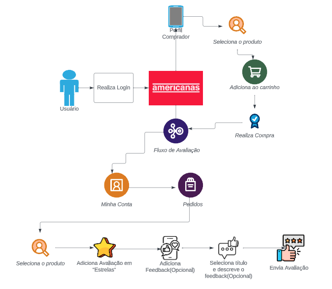

# 1. Desenho de Software (Base)

A Wiki ou GitPages do Projeto deve conter um tópico dedicado ao Módulo Desenho de Software (Base), com dois subtópicos principais, conforme [1.1](/docs/Base/1.1.AbordagemNaoEspecifica.md) e [1.2](/docs/Base/1.2.ProcessosMetodologiasAbordagens.md), e subtópico de cunho complementar, conforme [1.3](/docs/Base/1.3.ParticipacoesBase.md).

# Rich Picture

Um rich picture é um desenho de uma situação ou fluxo, que ilustra seus elementos e relacionamentos. Pode conter imagens, textos, símbolos, ícones, entre outros elementos usados para ilustrar algo graficamente. Ele ajuda a entender e desmantelar processos complexos, se baseando no fato de que nosso cerébro consegue absorver melhor imagens do que palavras.

