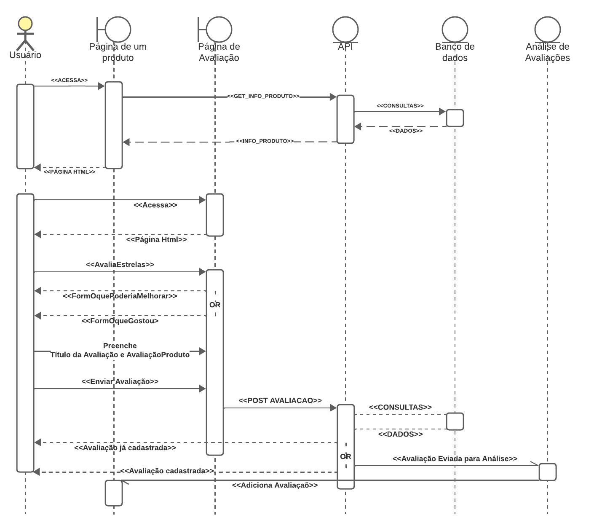

# 2.1.2.1. Diagrama de Sequência

## 1. Versionamento

| Versão |           Alteração           |  Responsável   |   Revisor    | Data |
| :----: | :-------------------------------------------------: | :----------------: | :----------------: | :---: |
| 1.0  | Criação do documento  | [Philipe Sousa](https://github.com/PhilipeSousa) | - | 04/10/2023 |
| 1.1  | Introdução  | [Philipe Sousa](https://github.com/PhilipeSousa) |  [José Luís Teixeira](https://github.com/joseluis-rt) | 04/10/2023 |
| 1.2  | Desenvolvimento do diagrama | [Philipe Sousa](https://github.com/PhilipeSousa) | - | 05/10/2023 |

 

 

## 2. Introdução

O diagrama de sequência é o tipo mais comum de diagrama de interação, concentrando-se na troca de mensagens entre um número de linhas de vida (lifelines). Este diagrama é uma poderosa ferramenta da UML (Unified Modeling Language) que ajuda a visualizar e entender como objetos ou componentes interagem ao longo do tempo, desempenhando um papel fundamental na modelagem de sistemas e na engenharia de software

 

## 3. Desenvolvimento

Agora abordaremos o processo de desenvolvimento de um diagrama de sequência que descreve o fluxo de avaliação de produtos no site das Americanas. Este artefato foi criado por Philipe de Sousa e Rafael Nobre, em colaboração, utilizando a ferramenta Lucidchart para a criação do diagrama. A comunicação e organização para a realização deste projeto ocorreram principalmente via Telegram.

Antes de começar a criar o diagrama de sequência, foi dedicado tempo para compreender como funciona o processo de avaliação de produtos no site das Americanas. Isso envolveu a análise dos requisitos do sistema, a identificação dos atores envolvidos (como usuário e sistema), e a compreensão dos eventos que desencadeiam a avaliação de produtos.

O próximo passo envolveu a criação do diagrama de sequência propriamente dito. Utilizando a plataforma Lucidchart, foram mapeados os passos do processo de avaliação de produtos em uma representação visual. Os objetos envolvidos, como a API, o banco de dados de produtos e o usuário, foram definidos.

**Diagrama de sequência fluxo de avaliação:**

 

## 4. Conclusão
 

 

## 5. Bibliografia

> [1] "UML-Diagrams,org" UML Diagrams. Disponível em: https://www.uml-diagrams.org/sequence-diagrams.html. Acesso em: 04 de outubro de 2023

