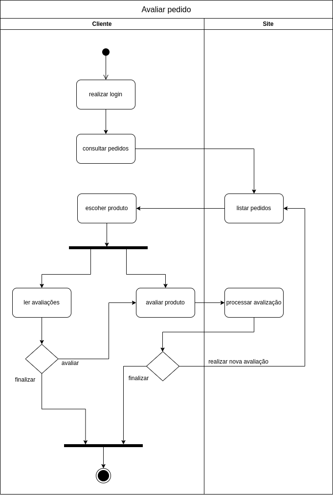
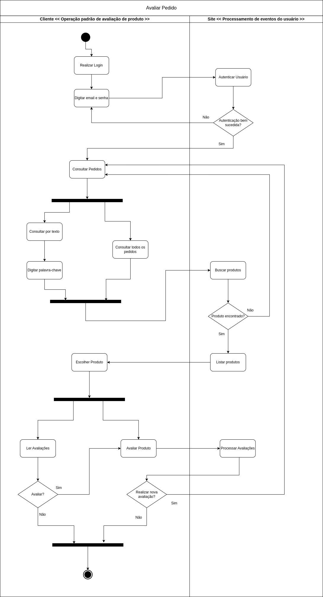

# 2.1.2.3. Diagrama de Atividades

## 1. Versionamento

| Versão |           Alteração           |  Responsável   |   Revisor    | Data |
| :----: | :-------------------------------------------------: | :----------------: | :----------------: | :---: |
| 1.0  | Criação do documento  | [Renan Lacerda](https://github.com/lacerdaRenan) | [Carlos Daniel Godoy](https://github.com/CDGodoy) & [Pablo Guedes](https://github.com/PabloChristianno) | 08/10/2023 |
| 1.1  | Desenvolvimento da introdução| [Renan Lacerda](https://github.com/lacerdaRenan) | [Carlos Daniel Godoy](https://github.com/CDGodoy) & [Pablo Guedes](https://github.com/PabloChristianno) | 08/10/2023 |
| 1.2  | Elaboração do diagrama de atividades | [Renan Lacerda](https://github.com/lacerdaRenan) & [Silas Neres](https://github.com/Silas-neres) | [Carlos Daniel Godoy](https://github.com/CDGodoy) & [Pablo Guedes](https://github.com/PabloChristianno) | 08/10/2023 |
| 1.3 |  Correção do diagrama no pages   | [Leonardo M. Miranda](https://github.com/leomichalski)  | [Pedro Vitor Jesus](https://github.com/Peedrooo) | 08/10/2023 |
| 1.4 | Alteração do diagrama de atividades | [Renan Lacerda](https://github.com/lacerdaRenan) | [Fellipe Pereira](https://github.com/fellipepcs) | 30/11/2023 |

## 2. Introdução

O diagrama de atividades é uma representação gráfica de comportamento na linguagem de modelagem UML. Ele ilustra o fluxo de controle ou o fluxo de objetos em um sistema, destacando a sequência e as condições do fluxo. Os modelos de atividades coordenam a execução de ações que podem ser iniciadas por diversas razões, como o término de outras ações, a disponibilidade de objetos e dados, ou a ocorrência de eventos externos ao processo.

### 2.1 Diagrama de Atividades
    
- Tipo de diagrama comportamental que representa graficamente o fluxo de controle de uma atividade para outra, com descrição de ações passo-a-passo em um sistema.

- Especifica a transformação de entradas em saídas por meio de uma sequência controlada temporal de ações.

- Semelhante a um fluxograma, porém, com suporte a concorrência(paralelismo) e sincronismo de atividades.

- Variação do *diagrama de estados*, que permite modelar comportamento baseado em fluxo.

## 3. Desenvolvimento

Para a elaboração do diagrama de atividades para o fluxo de avaliação de pedidos da Americanas, foi utilizada a ferramenta draw.io em conjunto com o material disponibilizado na disciplina. O fluxo pode ser divido em duas unidades organizacionais. A primeira é o cliente, que segue o seu fluxo de avaliação de pedidos. E a segunda é o site da americanas, que é responsável pela listagem dos produtos e processamento da avalização.

**Diagrama de Atividades (Versão 1):**

**Diagrama de Atividades (Versão 2):**

## 4. Conclusão

Em conclusão, o diagrama de atividades é uma valiosa ferramenta de modelagem visual da UML, essencial para representar o fluxo de controle ou objetos em sistemas ou processos. Sua capacidade de documentar a execução das atividades, com foco na sequência e nas condições de fluxo, o torna um instrumento fundamental para o desenvolvimento e a compreensão de sistemas e processos complexos. É uma ferramenta poderosa para engenheiros de software, analistas de negócios e outros profissionais que buscam criar representações visuais claras e precisas das atividades em seus projetos.
No escopo do fluxo de avaliação de pedidos, ao empregar o diagrama de atividades nesse contexto, é possível visualizar de maneira eficiente as etapas envolvidas, identificar possíveis gargalos e aprimorar a eficiência do processo, resultando em benefícios tangíveis para a operação do cliente.

## 5. Bibliografia

> [1] "UML-Diagrams.org" UML Diagrams. Disponível em: https://www.uml-diagrams.org/activity-diagrams.html. Acesso em: 08 de outubro de 2023
