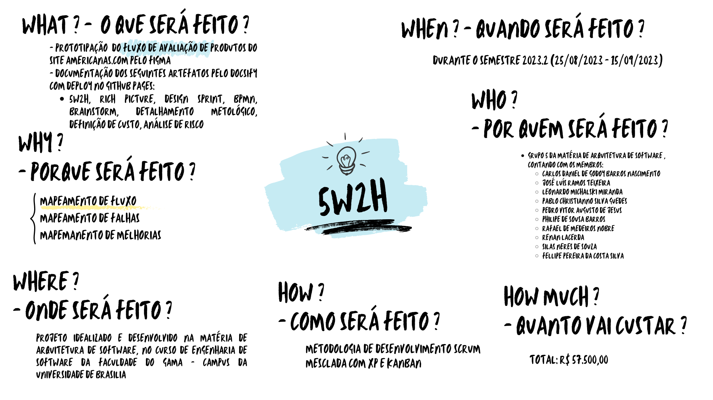
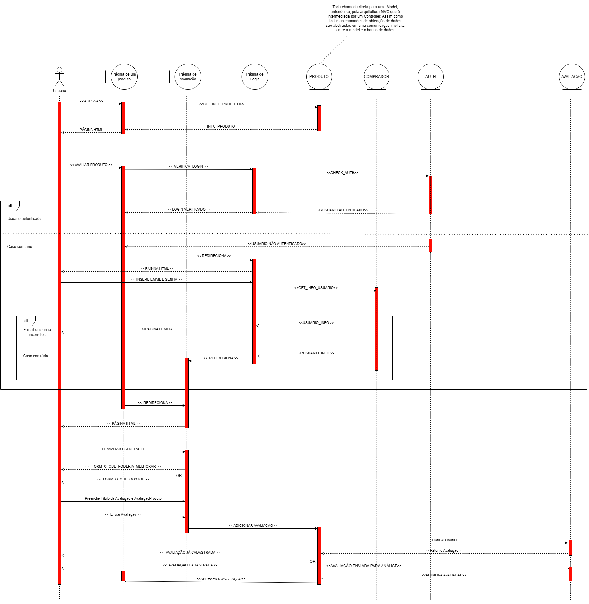
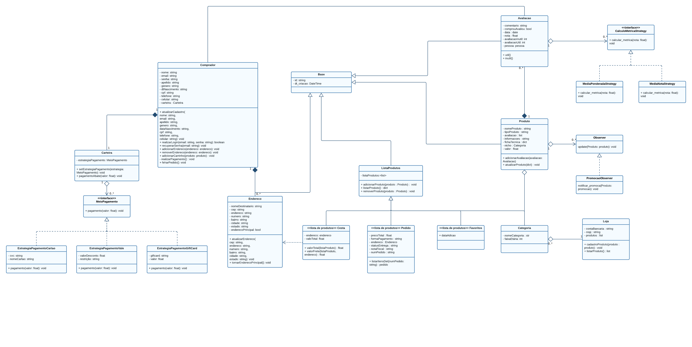
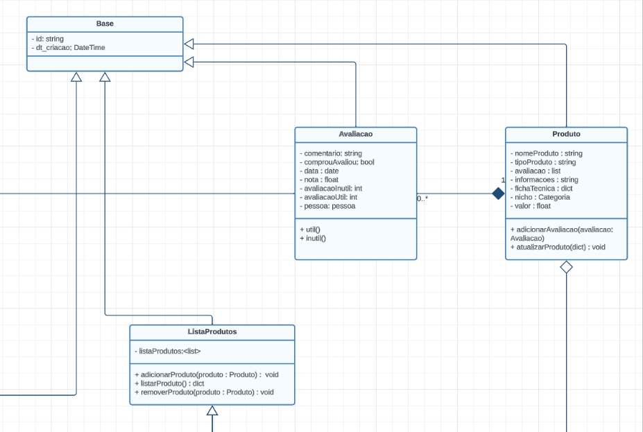

# 2023.2_G5_ProjetoAmericanas

**Código da Disciplina**: FGA0208 
**Número do Grupo**: 05 

## Alunos
| Foto | Matrícula | Aluno | Github |
| --- | --- | --- | --- |
|  | 19/0042303 | Carlos Daniel de Godoy Barros Nascimento | [CDGodoy](https://github.com/CDGodoy) |
|  | 20/0017772 | Fellipe Pereira da Costa Silva | [fellipepcs](https://github.com/fellipepcs) |
|  | 19/0057858 | José Luís Ramos Teixeira | [joseluis-rt](https://github.com/joseluis-rt) |
|  | 19/0046945 | Leonardo Michalski Miranda | [leomichalski](https://github.com/leomichalski) |
|  | 20/0042416 | Pablo Christianno Silva Guedes | [PabloChristianno](https://github.com/PabloChristianno) |
|  | 20/0073249 | Pedro Vitor Augusto de Jesus | [Peedrooo](https://github.com/Peedrooo) |
|  | 17/0154319 | Philipe de Sousa Barros | [PhilipeSousa](https://github.com/PhilipeSousa) |
|  | 20/0026488 | Rafael de Medeiros Nobre | [RafaelN0bre](https://github.com/RafaelN0bre) |
|  | 19/0048191 | Renan Rodrigues Lacerda | [lacerdaRenan](https://github.com/lacerdaRenan) |
|  | 20/0043536 | Silas Neres de Souza | [Silas-neres](https://github.com/Silas-neres) |

## Sobre 
A Lojas Americanas S.A. é uma empresa brasileira que se dedica essencialmente à operação de lojas de departamento. As atividades da Empresa se dividem em dois segmentos comerciais: Lojas tradicionais e E-commerce. É possível acessar o site clicando aqui ([Americanas](https://www.americanas.com.br/)) ou a partir do link https://www.americanas.com.br/

## Screenshots Primeira Entrega

Seguem alguns exemplos de artefatos que foram confeccionados para a primeira entrega **focada no DSW-Base**:

### 5W2H

### Rich Picture

### Protótipo
<iframe style="border: 1px solid rgba(0, 0, 0, 0.1);" width="800" height="450" src="https://www.figma.com/embed?embed_host=share&url=https%3A%2F%2Fwww.figma.com%2Ffile%2FsadFglPOkHgTv1tOKPi0wG%2FNovo-Prot%25C3%25B3tipo%3Ftype%3Ddesign%26node-id%3D0%253A1%26mode%3Ddesign%26t%3DCfHf9NXI1UCuwIma-1" allowfullscreen></iframe>

 
 
 

## Screenshots Segunda Entrega <<FOCO: DSW(Modelagem)>>
Seguem alguns exemplos de artefatos que foram confeccionados para a segunda entrega

### Diagrama de Sequência

### Diagrama de Classes

<!--
## <<FOCO: DSW(Padrões de Projeto)>>
Esse módulo/tópico será avaliado via Prova.
Portanto, sem necessidade de Screenshots.
-->

## Screenshots Terceira Entrega (FINAL) <<FOCOS: Arquitetura & Reutilização de Software & PROJETO FINAL>>
Seguem alguns exemplos de artefatos que foram confeccionados para a terceira entrega:

- [Documento arquitetural de software](./4.1.1.DAS.md) (DAS)

### DAS - Diagrama Entidade-Relacionamento (DE-R)

### DAS - Diagrama Lógico de Dados (DLD)

### Strategy

### Template Method

<!--
## Descritivo dos Principais Aspectos Técnicos 
**Principal(is) Metodologia(s) Adotada(s)**: xxxxxx 
**Principais Linguagens Utilizadas e/ou Pretendidas**: xxxxxx 
**Principais Tecnologias Utilizadas e/ou Pretendidas**: xxxxxx 
**Principal(is) Estilo(s) Arquitetural(is) Adotado(s)**: xxxxxx 

## Há algo a ser executado?

( ) SIM

( ) NÃO

Se SIM, insira um manual (ou um script) para auxiliar ainda mais os interessados na execução.

## Informações Complementares 
Quaisquer outras informações adicionais podem ser descritas nessa seção.
-->
